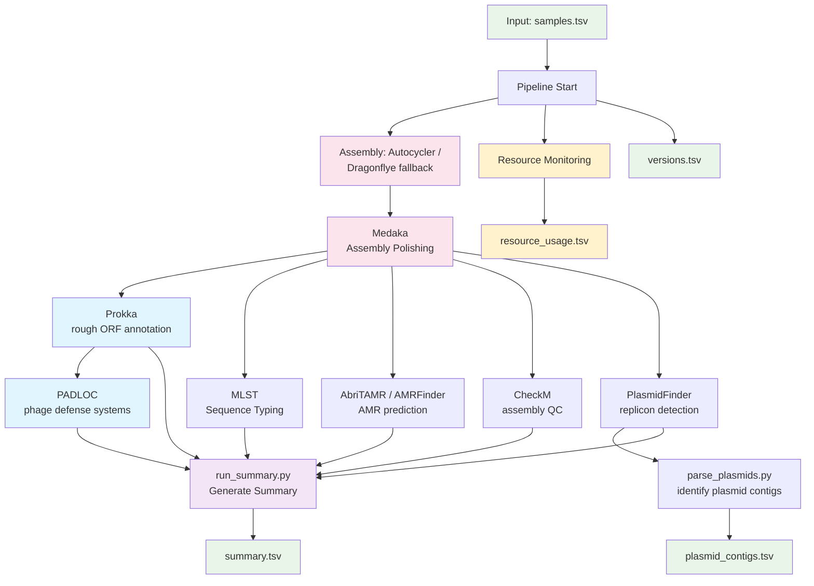

# BactoPipe - Bacterial ONT Sequence Analysis Pipeline

**A flexible, YAML-configured workflow-like pipeline for bacterial genome analysis from Oxford Nanopore sequencing data.**

## Table of Contents
- [1. Overview](#1-overview)
- [2. Quick Start](#2-quick-start)
- [3. Command Line Options](#3-command-line-options)
- [4. Input Requirements](#4-input-requirements)
- [5. Pipeline Workflow](#5-pipeline-workflow)
- [6. Expected Output Structure](#6-expected-output-structure)
- [7. Installation and Dependencies](#7-installation-and-dependencies)
- [8. YAML Configuration Guide](#8-yaml-configuration-guide)
- [9. FAQ](#9-faq)

## 1. Overview

BactoPipe automates the complete analysis of bacterial genomes from raw ONT sequencing data through final characterization. It performs high-quality assembly using Autocycler (with Dragonflye fallback), followed by Medaka polishing and downstream analysis including gene annotation, antimicrobial resistance detection, and plasmid identification.

*Note: Pipeline expects QC-processed data as input from a separate QC workflow*

**Key Features:**
- **YAML-Configured**: Human-readable configuration makes adding tools or changing parameters transparent and traceable
- **Resource Monitoring**: Built-in per-tool/per-sample CPU/memory tracking with optimization suggestions
- **Robust Execution**: Automatic output detection, dependency management, and intelligent error handling
- **Smart Recovery**: Re-runs skip existing outputs (unless `--force`), enabling easy recovery from failures
- **Selective Execution**: Run individual tools or tool subsets via `--tools`
- **Version Tracking**: Logs tool versions, script paths, and database locations for full reproducibility
- **Comprehensive Logging**: Detailed pipeline and per-sample logs for traceability and debugging
- **HPC Ready**: Module system integration with configurable parallelism for high-performance computing

## 2. Quick Start

A basic run just needs:
```bash
# Load python module for required packages
module load python

# Run complete pipeline for a normal sequencing run
python3 bactopipe.py -r RUNID
```

Other usage examples:
```bash
# Run with specific options
python3 bactopipe.py -r RUNID --force --clean

# Run specific tools only
./bactopipe.py -r RUN_ID --tools assembly prokka

# Re-run the mlst, summary file generation, and post-run cleanup steps
./bactopipe.py -r RUN_ID --tools mlst summarise cleanup --force

# Direct input/output mode (no run ID)
./bactopipe.py -i samples.tsv -o output_dir/

# Show detailed command output
./bactopipe.py -r RUN_ID --verbose

# Dry run (show what would be executed)
./bactopipe.py -r RUN_ID --dry-run
```

## 3. Command-Line Options

| Option | Description |
|--------|-------------|
| `-r, --runid` | Run ID for automatic path resolution |
| `-i, --input` | Path to samples TSV file (direct mode) |
| `-o, --output` | Output directory (direct mode) |
| `-c, --config` | Config file (default: `bactopipe_config.yaml`) |
| `--tools` | Run specific tools only (e.g., `--tools assembly prokka`) |
| `--dry-run` | Show commands without executing them |
| `--force` | Force re-run even if outputs exist |
| `--skip` | Skip tools with missing dependencies instead of failing |
| `--clean` | Overwrite log files instead of appending |
| `--verbose` | Print commands to console (default: commands only in logs) |
| `--tool_versions` | Show tool versions and exit |
| `-v, --version` | Show pipeline version |

## 4. Input Requirements

The core pipeline (bactopipe.py) expects a tab-separated input file with a header line and a column named `SAMPLE_ID` (configurable via `sample_id_column` setting).  

Samples with `SAMPLE_ID` matching entries in `allow_failed_sample_ids` (config setting) will be allowed to fail dependency checks

### 4.1 Sample File Format

The pipeline (per `bactopipe_config.yaml`) expects a tab-separated file (`samples.tsv`) with the following structure:

```
BARCODE    SAMPLE_ID  BARCODE_NAME  EXPECTED_SPECIES      IDENTIFIED_SPECIES     IDENTIFIED_GENOME_SIZE
barcode01  SAMPLE001  BC01          Escherichia coli      Escherichia coli       5000000
barcode02  SAMPLE002  BC02          Salmonella enterica   Salmonella enterica    4800000
barcode03  NEG        BC03          negative_control      Unclassified           0
```

**Column descriptions:**

| Column | Description | Usage |
|--------|-------------|-------|
| `BARCODE` | ONT barcode identifier | Used by summarise_run.py |
| `SAMPLE_ID` | **Required**: Unique sample identifier | Used throughout pipeline |
| `BARCODE_NAME` | Short barcode name | Used by summarise_run.py |
| `EXPECTED_SPECIES` | Expected species | Used by summarise_run.py |
| `IDENTIFIED_SPECIES` | Species from taxonomic classification | Used by summarise_run.py |
| `IDENTIFIED_GENOME_SIZE` | Estimated genome size (bp) | Used by run_assembly.sh for optimization |

## 5. Pipeline Workflow 
**(Per bactopipe_config.yaml)**



## 6. Expected Output Structure

```
/data/runs/ont/analysis/RUNID/
├── RUNID.run.log                                     # Main pipeline execution log
├── RUNID.versions.tsv                                # Tool versions and databases used
├── RUNID.summary.tsv                                 # Final summary table (all results)
├── RUNID.plasmid_contigs.tsv                         # Plasmid-AMR contig analysis
├── samples.tsv                                       # Sample manifest (copied from QC)
├── assembly/                                         # Genome assembly output
│   ├── {sample_id}.fa                                  #  Final polished assemblies (symlinks)
│   ├── unpolished_best/                                #  Unpolished assembly links
│   │   └── {sample}.{method}-unpolished.fa                #  e.g., sample.autocycler-reori-unpolished.fa
│   ├── autocycler/{sample_id}/                         #  Autocycler output
│   ├── dragonflye/{sample_id}/                         #  Dragonflye output (fallback)
│   ├── medaka/{sample_id}/                             #  Medaka polishing intermediates
│   │   ├── round1/                                        #  First polishing round
│   │   ├── round2/                                        #  Second polishing round  
│   │   └── {sample}.{method}-polished.fa                  #  e.g., sample.autocycler-reori-polished.fa
│   └── logs/                                           #  Tool-level assembly logs
├── prokka/                                           # Prokka annotations
│   └── {sample_id}/                                    #  Per-sample annotation files (.gff, .faa, etc.)
├── abritamr/                                         # AMR analysis
│   ├── abritamr.txt                                    #   Combined results
│   └── {sample_id}/                                    #   Per-sample detailed results
├── mlst/                                             # MLST typing
│   └── mlst.csv                                        #   Combined results
├── plasmidfinder/                                    # Plasmid replicon identification
│   ├── plasmidfinder_results.tsv                       #   Combined results
│   └── {sample_id}/                                    #   Per-sample detailed results
├── checkm/                                           # Assembly QC metrics
│   ├── checkm_results.tsv                              #   Combined results
│   └── {sample_id}/                                    #   Per-sample detailed results
└── padloc/                                           # Phage defense systems
    ├── padloc_summary.tsv                              #   Combined results
    └── {sample_id}/                                    #   Per-sample PADLOC output
```

### 6.1 Key Output Files

**Summary Table (`{runid}.summary.tsv`)** - Comprehensive results combining all analyses:
- QC metrics: `number_of_reads`, `number_of_bases`, `median_read_length`, `n50`, `median_qual`
- Species identification: `expected_species`, `identified_species`, `identified_genome_size`
- Assembly info: `assembly_method`, `contigs`, `num_contigs`, `longest_contig`, `coverage`
- Quality metrics: `assembly_size_bp`, `checkm_completeness`, `checkm_contamination`, `checkm_heterogeneity`
- Typing: `MLST_scheme`, `ST`
- AMR genes and plasmids (columns from abritamr output)

**Example summary.tsv:**
```
RUNID          SAMPLE_ID    BARCODE    EXPECTED_SPECIES      IDENTIFED_SPECIES     IDENTIFIED_GENOME_SIZE  number_of_reads  number_of_bases  median_read_length  n50    median_qual  Unclassified.Percentage  coverage  contigs                                                      num_contigs  longest_contig  assembly_method        MLST_scheme   ST   assembly_size_bp  checkm_completeness  checkm_contamination  checkm_heterogeneity  Plasmids                          Efflux            ESBL            AmpC     Streptomycin         Streptothricin  Trimethoprim  Tetracycline  Sulfonamide  Gentamicin  Cephalosporin  Amikacin/Kanamycin/Quinolone/Tobramycin  Clindamycin/Erythromycin/Streptogramin b  Azithromycin/Erythromycin/Spiramycin/Telithromycin  Beta-lactam
V2TEST         20GNB_0708   barcode11  Escherichia coli      Escherichia coli      5150000                 26974            127409482.0      2390.5              10034.0  18.6         3.1                      24        contig00001.5016581bp.20x.c, contig00002.10323bp.60x.c...  3            5016581         dragonflye.reoriented                             5029602           99.87                0.08                  0.0                                                 acrF*,mdtM*       blaCTX-M-14     blaEC*
V2TEST         20GNB_1129   barcode13  Escherichia coli      Escherichia coli      5150000                 48997            275986682.0      3187.0              10760.0  18.8         0.9                      53        contig00001.5257147bp.0x.l, contig00002.5677bp.0x.l       2            5257147         autocycler.reoriented                             5262824           99.92                0.08                  0.0                                                 acrF*,emrD*,mdtM* blaCTX-M-15     blaEC*                                                                                                          aac(3)-IIe                                                         blaOXA-1           aac(6')-Ib-cr5
20250627_CECE  PAB_10230    barcode03  Serratia marcescens   Serratia marcescens   5200000                 337229           383157924.0      355.0               3084.0   16.2         14.84                    73        contig00001.5385538bp.48x.c, contig00002.152248bp.73x.c...  9            5385538         autocycler                smarcescens   505  5622241.0         99.88                0.11                  0.0                   Col440I, IncFIB(K), IncFII(K), IncL/M  sdeB*,sdeY*,smfY* blaSRT-4*       tet(41)*                                             aac(6')   aac(3)-IId,aac(6')-Ib4                     blaTEM-1       mph(A)       sul1         catB3       blaIMP-4
20250627_CECE  PAB_10249    barcode08  Serratia marcescens   Serratia marcescens   5200000                 227110           160597216.0      303.0               1637.0   16.6         15.35                    30        contig00001.198313bp.14x.l, contig00002.127382bp.14x.l...  312          198313          autocycler                smarcescens   893  5621009.0         99.7                 1.49                  75.0                  IncFIA(HI1), IncFIB(K), IncL/M         sdeB*,sdeY*,smfY*               tet(41)*                                             aac(6')   aac(3)-IId,aac(6')-Ib4                     blaTEM-1       mph(A)       sul1         catB3       blaIMP-4     qnrB2
```

**Plasmid Analysis (`{runid}.plasmid_contigs.tsv`)** - Detailed plasmid-AMR mapping:
- Links plasmid replicons to resistance genes by contig
- Includes contig length and circularity information
- Useful for tracking plasmid-mediated resistance

**Example plasmid_contigs.tsv:**
```
SAMPLE_ID     Contig        Plasmidfinder     AMRfinder                                    Contig_length  Contig_circular
20GNB_0708    contig00001   -                 acrF,blaCTX-M-14,blaEC,emrD,fieF,iss...      5016581        Y
20GNB_0708    contig00002   Col156            -                                            10323          Y
20GNB_1129    contig00001   -                 aac(3)-IIe,blaCTX-M-15,blaOXA-1,catB3...     5257147        Y
20GNB_0903    contig00001   -                 acrF,blaCTX-M-27,blaEC,cnf1,emrD...          5009842        Y
20GNB_0903    contig00002   Col156,IncFII(29) aac(3)-IId,blaTEM-1,dfrA17,mph(A),sul1...    160390         Y
```

**Versions File (`{runid}.versions.tsv`)** - Tool and database tracking for reproducibility:
- Records pipeline, config, and all executed tools with versions, paths, and databases
- First run: `{runid}.versions.tsv`
- Subsequent runs: `{runid}.versions.YYYYMMDDHHMM.tsv` (timestamped to preserve records)
- Use `--clean` flag to overwrite instead of timestamping
- Only tools that actually executed are logged (skipped tools excluded)
- View without running: `./bactopipe.py --tool_versions`

**Example versions file:**
```
tool                    version         path                                      database
bactopipe.py            1.1             /path/to/bactopipe.py                     none
bactopipe_config.yaml   1.1             /path/to/config.yaml                      none
prokka                  1.14.6          /opt/conda/envs/prokka_1.14.6/bin/prokka  /opt/conda/envs/prokka_1.14.6/db
mlst                    mlst 2.23.0     /opt/conda/envs/nullarbor/bin/mlst        /data/db/mlst_custom
```


**Resource Usage (`{runid}.resource_usage.tsv`)** - Performance metrics and optimization:

The pipeline automatically monitors CPU and memory usage for each tool execution, providing insights for optimization:
- Peak memory and CPU usage per tool
- Current vs suggested parallelism settings
- System resource utilization percentages
- Bottleneck identification (memory vs CPU limited)

**Example resource usage file:**
```
tool      execution_mode  measurement_count  mean_memory_gb  max_memory_gb  mean_cpu_cores  max_cpu_cores  runtime_seconds  current_threads  suggested_threads  bottleneck
prokka    per_sample      12                 3.2             3.8            2.1             2.5            1847.3           4                8                  cpu
checkm    per_sample      12                 12.4            14.2           1.8             2.1            892.1            4                2                  memory
mlst      batch           1                  0.8             0.8            1.2             1.2            45.2             1                32                 cpu
```

Use this data to optimize the `parallel:` setting in your config for better performance.

## 7. Installation and Dependencies

### 7.1 System Requirements
`bactopipe.py` runs on python and bash. It is designed to use a linux module system for dependency management where available, but can also work on straight install paths. The rest of the pipeline dependencies / system requirements will depend on the pipeline configuration (`bactopipe_config.yaml`)

### 7.2 Python Dependencies
- Python 3.8+
- PyYAML
- pandas
- Standard library only (pathlib, subprocess, concurrent.futures)

### 7.3 Environment Modules
Environment modules are a Linux system for dynamically loading different versions of software tools without conflicts. Each tool is installed in its own conda environment and loaded via the module system. When you load a module, it adds the tool to your PATH and sets up the required environment.

**Learn more:** [Environment Modules User Guide](https://modules.readthedocs.io/en/latest/module.html)

### 7.4 Setting Up a New Installation
1. Ensure all tool modules are available:
   ```bash
   module avail 2>&1 | grep -E "prokka|abritamr|mlst|plasmidfinder|checkm|padloc"
   ```

2. Clone the pipeline:
   ```bash
   git clone /data/projects/pipelines/dev/jennyd/analysis_v2
   ```

3. Verify configuration:
   ```bash
   python3 bactopipe.py --tool_versions
   ```

4. Test with a small dataset:
   ```bash
   python3 bactopipe.py -r TEST_RUN --dry-run
   ```

## 8. YAML Configuration Guide

The pipeline is controlled by `bactopipe_config.yaml`. Each tool is defined with specific parameters controlling execution mode, parallelism, and dependencies.

### 8.1 Tool Configuration Structure

```yaml
tools:
  tool_name:
    description: "Tool purpose"
    modules: [module/version]          # Environment modules to load
    execution_mode: batch              # 'batch' or 'per_sample'
    parallel: 4                        # Concurrent jobs (per_sample mode only, 1=sequential)
    output_dir: "{rundir}/tool"        # Where outputs go
    output_file: "{output_dir}/final.tsv"        # Expected output (skip check)
    sample_output_file: "{output_dir}/{sample_id}.txt"  # Per-sample output (skip check)
    command: |                         # Main command to execute
      command(s) to execute
    pre_commands: []                   # Setup commands (optional)
    post_commands: []                  # Cleanup commands (optional)
    version_cmd: "tool --version"      # Version detection (optional)
    tool_path: "/path/to/tool"         # Tool location (optional)
    tool_path_cmd: "command to get tool path"  # Dynamic tool path detection (optional)
    db_path: "/path/to/database"       # Database location (optional)
    db_cmd: "command to get db path"   # Dynamic database detection (optional)
```

### 8.2 Execution Modes

**Batch mode**: Runs once for all samples together
- Tool executes: pre_commands → command → post_commands
- Single process handles entire dataset
- Example: MLST typing all genomes in one command

**Per-sample mode**: Runs separately for each sample
- Tool executes: pre_commands → parallel(command per sample) → post_commands
- `parallel` controls concurrency (default: 4, set to 1 for sequential)
- Thread count applies to sample parallelism, not tool threads
- Example: Prokka annotating each genome individually

### 8.3 Variable Substitution

Variables replaced at runtime:
- `{runid}` - Run identifier
- `{rundir}` - Analysis output directory path
- `{sample_id}` - Current sample id (per_sample mode only)
- `{assembly_file}` - Path to sample assembly file
- `{script_dir}` - Pipeline installation directory
- `{any_tool_field}` - Any field from the tool's config block

### 8.4 Skip Detection

Pipeline checks outputs before running tools:

1. For **batch** tools:
   - First checks `output_file` if defined
   - Then checks `sample_output_file` pattern for all samples
   - Skips if all expected outputs exist

2. For **per_sample** tools:
   - Checks `output_file` for final combined output
   - Checks each sample's `sample_output_file`
   - Skips individual samples with existing outputs
   - Runs only missing samples

Use `--force` to override skip detection.

### 8.5 Module System Configuration

Tools are automatically loaded when run using environment modules as specified in `bactopipe_config.yaml`:

```yaml
modules:
  - prokka/1.14.6
```

The pipeline handles all module loading automatically - you don't need to manually load modules before running.

### 8.6 Version and Database Tracking Configuration

The pipeline automatically tracks versions of all tools and databases (see section 6.1 for output details). This section describes how to configure version tracking for each tool.

**Configuration options:**

The pipeline uses linux-standard defaults, but allows customization for each tool in `bactopipe_config.yaml` as actual practice for tool builders can vary:

#### 8.6.1 Version Detection
Default: Calls `{tool_name} --version`
Customize: If your tool uses a different version flag or outputs to stderr
```yaml
version_cmd: "samtools 2>&1 | grep Version"  # Alternative flag
```

#### 8.6.2 Tool Path Detection
Default: Calls `which {tool_name}` to find tool in PATH
Customize: If tool is not in PATH or module system, or you want to record a specific installation
```yaml
tool_path: "/opt/custom/bin/tool"      # Explicit static path
tool_path: "{script_dir}/vendor/tool"  # Relative to pipeline
tool_path_cmd: "python -c 'import mymodule; print(mymodule.__file__)'"  # Dynamic lookup
```

#### 8.6.3 Database Version/Location Tracking
Default: Reports "none" (not all tools use databases!)
Customize: For tools that use reference databases (strongly recommended for reproducibility)
```yaml
db_path: "/data/db/mlst_custom"                                        # Static database path
db_cmd: "which padloc | sed 's|/bin/padloc$|/data|'"                  # Dynamic lookup from tool location
db_cmd: "grep 'database_version' {output_dir}/log.txt | cut -d' ' -f2"  # Parse from tool output
```

## 9. FAQ

**Quick Links:**
1. [How are assembly files organized and named?](#91-how-are-assembly-files-organized-and-named)
2. [What if a tool fails for some samples?](#92-what-if-a-tool-fails-for-some-samples)
3. [How do I resume a failed run?](#93-how-do-i-resume-a-failed-run)
4. [Can I run just specific tools?](#94-can-i-run-just-specific-tools)
5. [How do I add a new analysis tool?](#95-how-do-i-add-a-new-analysis-tool)
6. [Where are the log files?](#96-where-are-the-log-files)
7. [How do I optimize parallelism?](#97-how-do-i-optimize-parallelism)
8. [Can I use this pipeline without the module system?](#98-can-i-use-this-pipeline-without-the-module-system)

### 9.1 How are assembly files organized and named?

Assembly files use a hierarchical naming scheme to preserve method information throughout the pipeline:

**Unpolished assemblies** (in `assembly/unpolished_best/`):
- `{sample}.autocycler-reori-unpolished.fa` - Autocycler with reorientation
- `{sample}.autocycler-unpolished.fa` - Autocycler without reorientation
- `{sample}.dragonflye-unpolished.fa` - Dragonflye fallback assembly

**Polished assemblies** (in `assembly/medaka/{sample}/`):
- `{sample}.autocycler-reori-polished.fa` - Polished Autocycler with reorientation
- `{sample}.autocycler-polished.fa` - Polished Autocycler without reorientation
- `{sample}.dragonflye-polished.fa` - Polished Dragonflye assembly

**Final outputs** (in `assembly/`):
- `{sample}.fa` - Symlink to final polished assembly (standard interface for downstream tools)

This naming preserves assembly provenance throughout the pipeline while maintaining a clean interface for tools that don't need method details.

### 9.2 What if a tool fails for some samples?

By default, the pipeline will stop if a tool fails. Use `--skip` to continue processing even when tools fail. You can also specify samples that are allowed to fail (e.g., negative controls) in the config:

```yaml
settings:
  allow_failed_sample_ids: ["NEG", "BLANK"]
```

### 9.3 How do I resume a failed run?

Simply re-run the same command (e.g. `python bactopipe.py -r RUNID`). The pipeline automatically detects existing outputs and skips completed steps. Use `--force` to override this and rerun everything.

### 9.4 Can I run just specific tools?

Yes! Use `--tools` followed by the tool names. You can use also use `--force` to overwrite existing output if desired:
```bash
python3 bactopipe.py -r RUNID --tools prokka abritamr mlst --force
```

### 9.5 How do I add a new analysis tool?

Add it to `bactopipe_config.yaml` under the `tools:` section. See the Configuration Guide for details. Don't forget to add any dependencies to the `dependencies:` section.

### 9.6 Where are the log files?

- **Main pipeline log**: `{rundir}/{runid}.run.log`
- **Tool logs**: `{rundir}/{tool_name}/{tool_name}.log`
- **Sample logs**: `{rundir}/{tool_name}/{sample_id}/{sample_id}.{tool_name}.log`

### 9.7 How do I optimize parallelism?

Check the `suggested_threads` column in the resource usage file (see section 6.1). The pipeline calculates optimal parallelism based on tool resource usage and available system resources. Update the `parallel:` setting in the config for that tool.

### 9.8 Can I use this pipeline without the module system?

Yes! If tools are in your PATH, the pipeline will find them. You can also specify exact paths in the config using `tool_path`.
