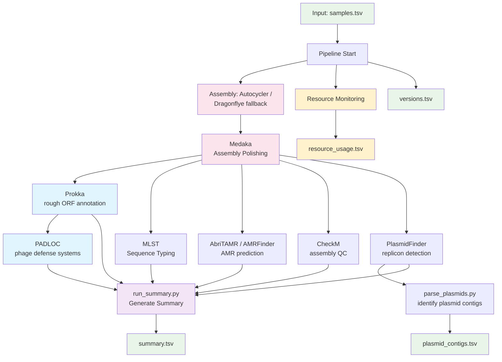

# BactoPipe:
## ONT Bacterial Genome Analysis Pipeline

**A flexible, YAML-configured workflow-like pipeline for bacterial genome analysis from Oxford Nanopore sequencing data.**

## Table of Contents
- [Overview](#overview)
- [Quick Start](#quick-start)
- [Command Line Options](#command-line-options)
- [Input Requirements](#input-requirements)
- [Pipeline Workflow](#pipeline-workflow)
- [Expected Output Structure](#expected-output-structure)
- [Configuration Guide](#configuration-guide)
- [Installation and Dependencies](#installation-and-dependencies)
- [Resource Management](#resource-management)
- [FAQ](#faq)

## Overview

BactoPipe automates the complete analysis of bacterial genomes from raw ONT sequencing data through final characterization. It performs high-quality assembly using Autocycler (with Dragonflye fallback), followed by Medaka polishing and downstream analysis including gene annotation, antimicrobial resistance detection, and plasmid identification.

*Note: Pipeline expects QC-processed data as input from a separate QC workflow*

**Key Features:**
- **Smart Assembly Strategy**: Autocycler for optimal bacterial genome assembly with automatic Dragonflye fallback; assembly and Medaka polishing run as separate steps for optimized parallelism
- **Assembly Method Tracking**: Descriptive filenames preserve assembly method through the pipeline (e.g., `sample.autocycler-reori-polished.fa`)
- **YAML-Configured**: Human-readable configuration makes adding tools or changing parameters transparent and traceable
- **Resource Monitoring**: Built-in per-tool/per-sample CPU/memory tracking with optimization suggestions
- **Robust Execution**: Automatic output detection, dependency management, and intelligent error handling
- **Smart Recovery**: Re-runs skip existing outputs (unless `--force`), enabling easy recovery from failures
- **Selective Execution**: Run individual tools or tool subsets via `--tools`
- **Version Tracking**: Logs tool versions, script paths, and database locations for full reproducibility
- **Comprehensive Logging**: Detailed pipeline and per-sample logs for traceability and debugging
- **HPC Ready**: Module system integration with configurable parallelism for high-performance computing

## Quick Start

```bash
# Load python module for required packages
module load python

# Run complete pipeline for a normal sequencing run
python3 bactopipe.py -r RUNID

# Run with specific options
python3 bactopipe.py -r RUNID --force --clean

# Run specific tools only
python3 bactopipe.py -r RUNID --tools prokka abritamr mlst

# Check tool versions without running
python3 bactopipe.py --tool_versions

# Direct input/output mode
python3 bactopipe.py -i samples.tsv -o output_directory/
```

## Command Line Options

### Required Arguments (one of):
- `-r, --runid RUNID` - Run ID for ONT sequencing run (e.g., 20241118_RDRD)
- `-i, --input FILE` and `-o, --output DIR` - Custom input samples file and output directory

### Optional Flags:
- `--force` - Overwrite existing outputs (default: skip completed analyses)
- `--dry-run` - Show commands without executing them
- `--skip` - Continue processing even if some tools fail
- `--clean` - Start fresh log files instead of appending
- `--tools TOOL [TOOL...]` - Run only specified tools (e.g., `--tools prokka mlst`)
- `--tool_versions` - Display versions of all configured tools and exit
- `-c, --config FILE` - Use alternate config file (default: bactopipe_config.yaml)
- `-v, --version` - Report pipeline version number

## Input Requirements

### Sample File Format
The pipeline expects a tab-separated file (`samples.tsv`) with the following structure:

```
BARCODE	SAMPLE_ID	BARCODE_NAME	EXPECTED_SPECIES	IDENTIFIED_SPECIES	IDENTIFIED_GENOME_SIZE
barcode01	SAMPLE001	BC01	Escherichia coli	Escherichia coli	5000000
barcode02	SAMPLE002	BC02	Salmonella enterica	Salmiella enterica	4800000
barcode03	NEG	BC03	negative_control	Unclassified	0
```

**Core Requirements:**
- **Pipeline core** requires only a column named `SAMPLE_ID` (configurable via `sample_id_column` setting)
- **Header line** is required for column name detection
- **Current tool configuration** expects the full 6-column format shown above

**Column descriptions:**
- `BARCODE` - ONT barcode identifier (used by summarise_run.py)
- `SAMPLE_ID` - **Required**: Unique sample identifier used throughout pipeline
- `BARCODE_NAME` - Short barcode name (used by summarise_run.py)
- `EXPECTED_SPECIES` - Expected species (used by summarise_run.py)
- `IDENTIFIED_SPECIES` - Species identified by taxonomic classification (used by summarise_run.py)
- `IDENTIFIED_GENOME_SIZE` - Estimated genome size in base pairs (used by run_assembly.sh for optimization)

**Notes:**
- Header line is required and will be skipped during processing
- Samples with `SAMPLE_ID` matching entries in `allow_failed_sample_ids` (config setting) will be allowed to fail dependency checks
- Empty or `0` values in `IDENTIFIED_GENOME_SIZE` will trigger meta-assembly mode in some tools

## Pipeline Workflow 
### (Per bactopipe_config.yaml)



## Expected Output Structure

```
/data/runs/ont/analysis/RUNID/
├── RUNID.run.log                                     # Main pipeline execution log
├── RUNID.versions.tsv                                # Tool versions and databases used
├── RUNID.summary.tsv                                 # Final summary table (all results)
├── RUNID.plasmid_contigs.tsv                         # Plasmid-AMR contig analysis
├── samples.tsv                                       # Sample manifest (copied from QC)
├── assembly/                                         # Genome assembly output
│   ├── {sample_id}.fa                                  #  Final polished assemblies (symlinks)
│   ├── unpolished_best/                                #  Unpolished assembly links
│   │   └── {sample}.{method}-unpolished.fa                #  e.g., sample.autocycler-reori-unpolished.fa
│   ├── autocycler/{sample_id}/                         #  Autocycler output
│   ├── dragonflye/{sample_id}/                         #  Dragonflye output (fallback)
│   ├── medaka/{sample_id}/                             #  Medaka polishing intermediates
│   │   ├── round1/                                        #  First polishing round
│   │   ├── round2/                                        #  Second polishing round  
│   │   └── {sample}.{method}-polished.fa                  #  e.g., sample.autocycler-reori-polished.fa
│   └── logs/                                           #  Tool-level assembly logs
├── prokka/                                           # Prokka annotations
│   └── {sample_id}/                                    #  Per-sample annotation files (.gff, .faa, etc.)
├── abritamr/                                         # AMR analysis
│   ├── abritamr.txt                                    #   Combined results
│   └── {sample_id}/                                    #   Per-sample detailed results
├── mlst/                                             # MLST typing
│   └── mlst.csv                                        #   Combined results
├── plasmidfinder/                                    # Plasmid replicon identification
│   ├── plasmidfinder_results.tsv                       #   Combined results
│   └── {sample_id}/                                    #   Per-sample detailed results
├── checkm/                                           # Assembly QC metrics
│   ├── checkm_results.tsv                              #   Combined results
│   └── {sample_id}/                                    #   Per-sample detailed results
└── padloc/                                           # Phage defense systems
    ├── padloc_summary.tsv                              #   Combined results
    └── {sample_id}/                                    #   Per-sample PADLOC output
```

### Key Output Files

**Summary Table (`{runid}.summary.tsv`)** - Comprehensive results combining all analyses:
- QC metrics: `number_of_reads`, `number_of_bases`, `median_read_length`, `n50`, `median_qual`
- Species identification: `expected_species`, `identified_species`, `identified_genome_size`
- Assembly info: `assembly_method`, `contigs`, `num_contigs`, `longest_contig`, `coverage`
- Quality metrics: `assembly_size_bp`, `checkm_completeness`, `checkm_contamination`, `checkm_heterogeneity`
- Typing: `MLST_scheme`, `ST`
- AMR genes and plasmids (columns from abritamr output)

**Plasmid Analysis (`{runid}.plasmid_contigs.tsv`)** - Detailed plasmid-AMR mapping:
- Links plasmid replicons to resistance genes by contig
- Includes contig length and circularity information
- Useful for tracking plasmid-mediated resistance

## Configuration Guide

The pipeline is controlled by `bactopipe_config.yaml`. Each tool is defined with specific parameters controlling execution mode, parallelism, and dependencies.

### Tool Configuration Structure

```yaml
tools:
  tool_name:
    description: "Tool purpose"
    modules: [module/version]          # Environment modules to load
    execution_mode: batch              # 'batch' or 'per_sample'
    parallel: 4                        # Concurrent jobs (per_sample mode only, 1=sequential)
    output_dir: "{rundir}/tool"        # Where outputs go
    output_file: "{output_dir}/final.tsv"        # Expected output (skip check)
    sample_output_file: "{output_dir}/{sample_id}.txt"  # Per-sample output (skip check)
    command: |                         # Main command to execute
      command(s) to execute
    pre_commands: []                   # Setup commands (optional)
    post_commands: []                  # Cleanup commands (optional)
    version_cmd: "tool --version"      # Version detection (optional)
    tool_path: "/path/to/tool"         # Tool location (optional)
    db_path: "/path/to/database"       # Database location (optional)
    db_cmd: "command to get db path"   # Dynamic database detection (optional)
```

### Execution Modes

**Batch mode**: Runs once for all samples together
- Tool executes: pre_commands → command → post_commands
- Single process handles entire dataset
- Example: MLST typing all genomes in one command

**Per-sample mode**: Runs separately for each sample
- Tool executes: pre_commands → parallel(command per sample) → post_commands
- `parallel` controls concurrency (default: 4, set to 1 for sequential)
- Thread count applies to sample parallelism, not tool threads
- Example: Prokka annotating each genome individually

### Variable Substitution

Variables replaced at runtime:
- `{runid}` - Run identifier
- `{rundir}` - Analysis output directory path
- `{sample_id}` - Current sample id (per_sample mode only)
- `{assembly_file}` - Path to sample assembly file
- `{script_dir}` - Pipeline installation directory
- `{any_tool_field}` - Any field from the tool's config block

### Skip Detection

Pipeline checks outputs before running tools:

1. For **batch** tools:
   - First checks `output_file` if defined
   - Then checks `sample_output_file` pattern for all samples
   - Skips if all expected outputs exist

2. For **per_sample** tools:
   - Checks `output_file` for final combined output
   - Checks each sample's `sample_output_file`
   - Skips individual samples with existing outputs
   - Runs only missing samples

Use `--force` to override skip detection.

### Version and Database Tracking

Version information is collected for the `.versions.tsv` file:

#### Version detection:
The pipeline calls `{tool_name} --version` by default. If this won't work for your tool,
you can specify a custom command using:
```
version_cmd: "command"  # Custom command to extract version info if needed
```

#### Tool path detection:
The pipeline calls `which {tool_name}` by default. If you need to specify an exact path,
you can set:
```
tool_path: "/path/to/tool"  # Explicit tool path if needed
```
#### Database detection:
The pipeline reports "none" by default. If you want to track database locations,
you can specify either:
```
db_path: "/data/db/tool_db"   # Static database path
db_cmd: "command"             # Custom command to extract database info from tool/logs
```

### Complete Example

Adding a new AMR tool:

```yaml
tools:
  resfinder:
    description: "ResFinder antimicrobial resistance gene detection"
    modules: [resfinder/4.1.0]
    execution_mode: per_sample
    parallel: 8                        # Run 8 samples simultaneously
    output_dir: "{rundir}/resfinder"
    sample_output_file: "{output_dir}/{sample_id}/results.json"
    pre_commands:
      - mkdir -p {output_dir}
    command: |
      resfinder.py \
        -i {assembly_file} \
        -o {output_dir}/{sample_id} \
        -s "Escherichia coli" \
        --acquired
    post_commands:
      - python3 {script_dir}/merge_resfinder.py {output_dir}
    version_cmd: "resfinder.py --version 2>&1 | head -1"
    db_path: "/opt/resfinder/database"
```

This configuration will:
1. Check if sample outputs exist before running
2. Create output directory once
3. Run ResFinder on up to 8 samples in parallel
4. Merge results after all samples complete
5. Track version and database in pipeline logs


## Installation and Dependencies

### System Requirements
The pipeline uses a module system for dependency management where possible but can also work on straight install paths.

### Environment Modules
Environment modules are a Linux system for dynamically loading different versions of software tools without conflicts. Each tool is installed in its own conda environment and loaded via the module system. When you load a module, it adds the tool to your PATH and sets up the required environment.

**Learn more:** [Environment Modules User Guide](https://modules.readthedocs.io/en/latest/module.html)

### Module System in the Pipeline
Tools are automatically loaded using environment modules as specified in `bactopipe_config.yaml`. The pipeline handles all module loading - you don't need to manually load modules before running.

```yaml
modules:
  - prokka/1.14.6
```

### Available Tool Modules
- `assembly` - Genome assembly (via autocycler/dragonflye)
- `prokka/1.14.6` - Genome annotation
- `abritamr/1.0.17` - AMR detection with AMRFinderPlus
- `mlst/2.23.0` - Multi-locus sequence typing
- `plasmidfinder/2.1.6` - Plasmid identification
- `checkm-genome/1.2.2` - Assembly quality control
- `padloc/2.0.0` - Defense system detection

### Python Dependencies
- Python 3.8+
- PyYAML
- Standard library only (pathlib, subprocess, concurrent.futures)

### Database Locations
Databases are managed per-tool and tracked in the versions output:
- ABRitAMR: AMRFinderPlus database (auto-updated)
- PlasmidFinder: Plasmid reference database
- CheckM: Marker gene database
- PADLOC: HMM profiles for defense systems

### Setting Up a New Installation
1. Ensure all tool modules are available:
   ```bash
   module avail 2>&1 | grep -E "prokka|abritamr|mlst|plasmidfinder|checkm|padloc"
   ```

2. Clone the pipeline:
   ```bash
   git clone /data/projects/pipelines/dev/jennyd/analysis_v2
   ```

3. Verify configuration:
   ```bash
   python3 bactopipe.py --tool_versions
   ```

4. Test with a small dataset:
   ```bash
   python3 bactopipe.py -r TEST_RUN --dry-run
   ```

## Resource Management

BactoPipe includes intelligent resource monitoring and optimization:

- **Automatic monitoring** of CPU and memory usage per tool
- **Resource-aware parallelism** with bottleneck detection  
- **Optimization suggestions** for improving performance
- **Configurable limits** with safety caps to prevent system overload

Resource logs are saved to `{runid}.resource_usage.{timestamp}.tsv` for analysis.

## FAQ

**Quick Links:**
1. [How are assembly files organized and named?](#1-how-are-assembly-files-organized-and-named)
2. [What if a tool fails for some samples?](#2-what-if-a-tool-fails-for-some-samples)
3. [How do I resume a failed run?](#3-how-do-i-resume-a-failed-run)
4. [Can I run just specific tools?](#4-can-i-run-just-specific-tools)
5. [How do I add a new analysis tool?](#5-how-do-i-add-a-new-analysis-tool)
6. [Where are the log files?](#6-where-are-the-log-files)
7. [What does the resource usage file show?](#7-what-does-the-resource-usage-file-show)
8. [How do I optimize parallelism?](#8-how-do-i-optimize-parallelism)
9. [Can I use this pipeline without the module system?](#9-can-i-use-this-pipeline-without-the-module-system)

### 1. How are assembly files organized and named?

Assembly files use a hierarchical naming scheme to preserve method information throughout the pipeline:

**Unpolished assemblies** (in `assembly/unpolished_best/`):
- `{sample}.autocycler-reori-unpolished.fa` - Autocycler with reorientation
- `{sample}.autocycler-unpolished.fa` - Autocycler without reorientation
- `{sample}.dragonflye-unpolished.fa` - Dragonflye fallback assembly

**Polished assemblies** (in `assembly/medaka/{sample}/`):
- `{sample}.autocycler-reori-polished.fa` - Polished Autocycler with reorientation
- `{sample}.autocycler-polished.fa` - Polished Autocycler without reorientation
- `{sample}.dragonflye-polished.fa` - Polished Dragonflye assembly

**Final outputs** (in `assembly/`):
- `{sample}.fa` - Symlink to final polished assembly (standard interface for downstream tools)

This naming preserves assembly provenance throughout the pipeline while maintaining a clean interface for tools that don't need method details.

### 2. What if a tool fails for some samples?

By default, the pipeline will stop if a tool fails. Use `--skip` to continue processing even when tools fail. You can also specify samples that are allowed to fail (e.g., negative controls) in the config:

```yaml
settings:
  allow_failed_sample_ids: ["NEG", "BLANK"]
```

### 3. How do I resume a failed run?

Simply re-run the same command. The pipeline automatically detects existing outputs and skips completed steps. Use `--force` to override this and rerun everything.

### 4. Can I run just specific tools?

Yes! Use `--tools` followed by the tool names:
```bash
python3 bactopipe.py -r RUNID --tools prokka abritamr mlst
```

### 5. How do I add a new analysis tool?

Add it to `bactopipe_config.yaml` under the `tools:` section. See the Configuration Guide for details. Don't forget to add any dependencies to the `dependencies:` section.

### 6. Where are the log files?

- **Main pipeline log**: `{rundir}/{runid}.run.log`
- **Tool logs**: `{rundir}/{tool_name}/{tool_name}.log`
- **Sample logs**: `{rundir}/{tool_name}/{sample_id}/{sample_id}.{tool_name}.log`

### 7. What does the resource usage file show?

The `{runid}.resource_usage.tsv` file shows:
- Peak memory and CPU usage per tool
- Current parallelism settings
- Suggested parallelism based on system resources
- Bottleneck identification (memory vs CPU)

### 8. How do I optimize parallelism?

Check the `suggested_threads` column in the resource usage file. The pipeline calculates optimal parallelism based on tool resource usage and available system resources. Update the `parallel:` setting in the config for that tool.

### 9. Can I use this pipeline without the module system?

Yes! If tools are in your PATH, the pipeline will find them. You can also specify exact paths in the config using `tool_path:`.
